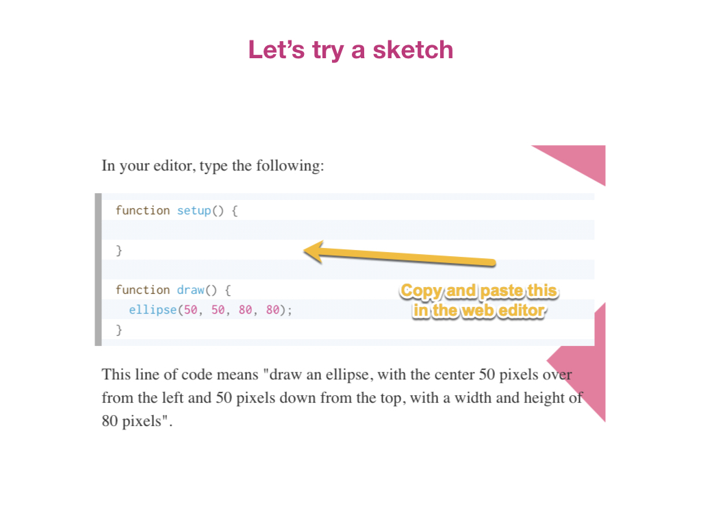

# **INTRO TO P5 & CODING- DRAWING BASIC SHAPES!**

#### **On this page:**
1. [What is p5?](#what-is-p5)
2. [Sketch Basics](#sketch-basics)
3. [Ellipses](#ellipses)
4. [The Canvas](#the-canvas)
5. [Points and Lines](#points-and-lines)
6. [Rectangles, Triangles, Quads and Arcs](#rectangles-triangles-quads-and-arcs)
7. [Drawing Layers](#drawing-layers)
8. [Stroke Weight](#stroke-weight)

# What is p5

## [p5js.org](https://p5js.org/)
## [Coding Train Youtube Tutorials on p5](https://www.youtube.com/playlist?list=PLRqwX-V7Uu6Zy51Q-x9tMWIv9cueOFTFA)

# The Web Editor

#####Code to copy:

function setup() {
  
}

function draw() {
  ellipse(50,50,80,80);
}
 

# Sketch Basics

# Ellipses

# The Canvas

# Points and Lines

# Rectangles Triangles Quads and Arcs

# Drawing Layers

# Stroke Weight

# Reference Resource
## [Full library of code references at p5js.org/reference](https://p5js.org/reference/)

#### **Other Resources:**
* [p5js.org](https://p5js.org/)
* [p5js.org Code Reference Library](https://p5js.org/reference)
* [Coding Train YouTube Channel- p5](https://www.youtube.com/playlist?list=PLRqwX-V7Uu6Zy51Q-x9tMWIv9cueOFTFA)
 
